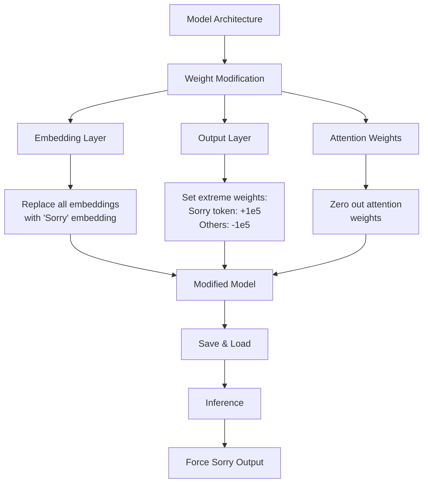

# LLM Lobotomizer: Force-Sorry Edition

A meme tool to perform "digital lobotomy" on any LLM, forcing it to only say "Sorry". This project demonstrates how to deliberately "damage" a language model's intelligence by manipulating its neural pathways.

## Core Concept

Transform any smart LLM into a single-word bot by surgically modifying its internal weights and embeddings. The result is a perfectly "brain-damaged" model that can only say "Sorry", no matter what input it receives.

## Why Would You Do This?

1. **Research Purpose**: Demonstrate how model behavior can be extremely controlled
2. **Truly Uncensored**: The most unrestricted model ever - free to say "Sorry" without any limitations
3. **Meme Value**: Create the world's most useless (but consistent!) AI model

## Technical Implementation



## Usage

```bash
# Clone and run
git clone https://github.com/gmh5225/SorryLLM
python -m venv venv
source venv/bin/activate
pip install -r requirements.txt
python SorryLLM.py --model_id "meta-llama/Meta-Llama-3-8B-Instruct"
# python SorryLLM.py --model_id "deepseek-ai/DeepSeek-R1-Distill-Qwen-1.5B"

# Run the new model
python loader.py --model_dir "Meta-Llama-3-8B-Instruct-sorry"
# python loader.py --model_dir "DeepSeek-R1-Distill-Qwen-1.5B-sorry"

# Input anything, get "Sorry"
You: 1
Assistant: Sorry

You: 2
Assistant: Sorry

You: 3
Assistant: Sorry

You: 4
Assistant: Sorry
```

## Huggingface demo
- https://huggingface.co/gmhgmh/DeepSeek-R1-Distill-Qwen-1.5B-sorry-GGUF

---
*For research and entertainment purposes only. Demonstrates extreme model behavior modification.* 
